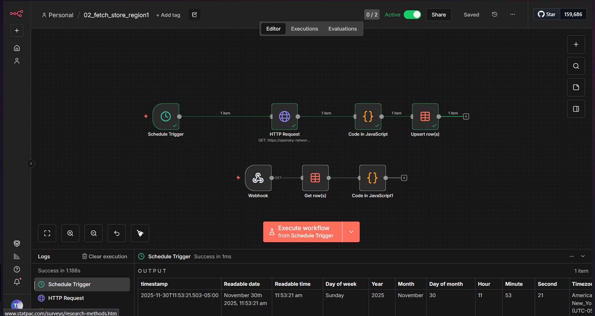
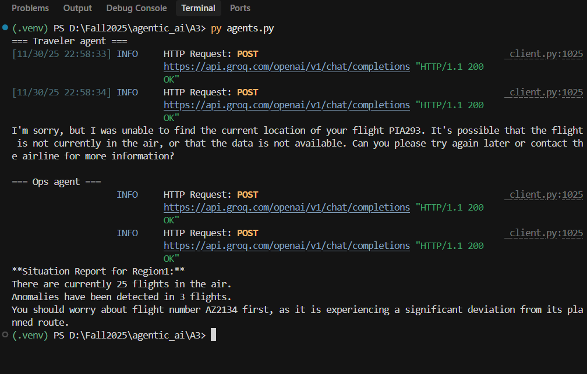
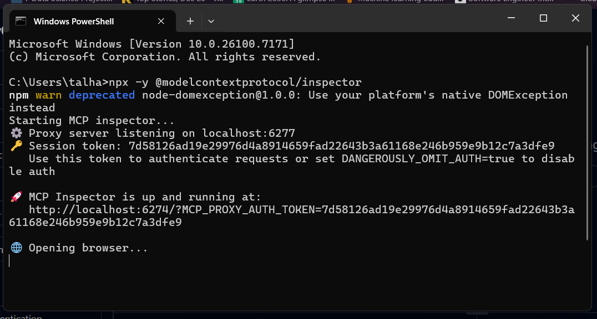

## Simple MCP–n8n Airspace Copilot

This project is a **minimal end‑to‑end airspace copilot** that connects:

- **n8n workflows** that periodically fetch flight data (e.g., from OpenSky) and expose it via HTTP webhooks.
- An **MCP server** (`server.py`) that wraps those webhooks as strongly‑typed MCP tools.
- **Groq‑backed agents** (`agents.py`) that call those tools to reason about flight status and anomalies.
- A **Streamlit UI** (`ui_app.py`) that lets travelers and ops staff interact with the system in the browser.

It is designed as a simple but complete example of an **agentic tools + workflows stack**: data flows from n8n → MCP tools → agents → UI.

---

### Introduction & Problem Statement

Modern airline operations and passengers both have access to raw flight‑tracking data, but:

- **Passengers** struggle to interpret altitudes, speeds, and positions into answers like “Is my flight OK?”  
- **Ops teams** need a concise view of **regional traffic and anomalies** rather than raw state vectors.  
- Many systems are **tightly coupled** to a single API and lack a clean separation between:
  - Data collection (scheduled workflows),
  - Tooling interfaces (MCP),
  - Reasoning (LLM agents),
  - User experience (UI).

This project addresses that gap by:

- Using **n8n** to periodically fetch and cache flight snapshots.
- Exposing those snapshots as **MCP tools** that any agent or client can call.
- Building **Groq‑based agents** that can call the tools and coordinate with each other.
- Providing a **simple web UI** where travelers and ops staff can ask natural‑language questions.

The result is a compact, extensible example of an **agentic AI system over live(ish) aviation data**.

---

### System Architecture

High‑level flow:

1. **n8n** periodically calls an aviation data API (e.g. OpenSky), normalizes the response, and stores the latest snapshot per region.
2. n8n exposes HTTP **webhooks** (e.g. `REGION1_WEBHOOK`) that always return the latest snapshot as JSON.
3. The **MCP server** (`server.py`) defines tools that internally call those webhooks and return strongly typed results.
4. **Groq agents** (`agents.py`) call those tools via tool‑calling.
5. The **Streamlit UI** (`ui_app.py`) provides two personas:
   - **Traveler**: focuses on a single callsign.
   - **Ops**: focuses on regional traffic and anomalies.

Architecture diagram (from the assignment, implemented here):



Additional inspector / debugging views:

- Agent tool‑calling inspector:  
  
- MCP inspector / HTTP flow:  
  

---

### n8n Workflows & Snapshot Storage

The n8n workflows (not stored in this repo) are responsible for:

- **Fetching data** from an aviation API on a schedule (e.g. every N seconds).
- **Transforming** the raw state vectors into a normalized snapshot shape:
  - `region`: region identifier (e.g. `"region1"`).
  - `snapshot_time`: Unix timestamp of the snapshot.
  - `fetched_at_iso`: ISO8601 timestamp of when n8n fetched it.
  - `flight_count`: number of flights.
  - `flights`: list of flight dicts with keys like `icao24`, `callsign`, `origin_country`, `latitude`, `longitude`, `geo_altitude`, `velocity`, `vertical_rate`, `on_ground`, etc.
- **Caching** the latest snapshot in memory or a simple store inside n8n.
- **Exposing** the latest snapshot via an HTTP webhook endpoint per region:
  - Example: `http://localhost:5678/webhook/latest-region1`

In this project, the Python code never talks directly to OpenSky. Instead, it trusts that **n8n owns data collection and caching**, and simply pulls the most recent snapshot on demand via HTTP.

---

### MCP Server & Tools (`server.py`)

The MCP server uses **FastMCP** (`mcp.server.fastmcp.FastMCP`) and exposes an HTTP endpoint using the `streamable-http` transport.

- **Type definitions** (via `typing_extensions.TypedDict`):
  - `Flight`: a single aircraft’s state, with fields like `icao24`, `callsign`, `origin_country`, `latitude`, `longitude`, `geo_altitude`, `velocity`, `vertical_rate`, `on_ground`, etc.
  - `Snapshot`: a region snapshot containing metadata and a list of `Flight`.
  - `FlightLookupResult`: metadata + an optional `flight` + a human‑readable message.
  - `Alert` and `AlertResult`: anomaly descriptions and severity.

- **Webhook configuration**:
  - `REGION_WEBHOOKS` is a dictionary mapping region IDs to webhook URLs.
  - URLs can be overridden via environment variables, e.g.:
    - `REGION1_WEBHOOK` (default: `http://localhost:5678/webhook/latest-region1`).

- **Internal helper**:
  - `_fetch_snapshot(region)`:
    - Validates that the region exists.
    - Calls the configured n8n webhook using `requests`.
    - Ensures `region` and `flight_count` fields are present.

Exposed MCP tools:

- **`flights_list_region_snapshot(region: str = "region1") -> Snapshot`**  
  Returns the latest cached snapshot for the given region.

- **`flights_get_by_callsign(callsign: str, region: str = "region1") -> FlightLookupResult`**  
  - Searches the latest snapshot for `callsign`.
  - Returns a result with:
    - `flight` (or `None`),
    - `message` describing the outcome,
    - `region`, `snapshot_time`, and `fetched_at_iso`.

- **`alerts_list_active(region: str = "region1") -> AlertResult`**  
  Simple rule‑based anomaly detection:
  - Flags flights with **low speed at high altitude** (e.g. `alt > 8000` and `velocity < 100 m/s`).
  - Flags **very high climb/descent rates** (e.g. `vertical_rate > 20` or `< -20` m/s).

These tools are what agents and external MCP clients see; they hide the n8n details behind a clean tool interface.

---

### Agents, Prompts & A2A Communication (`agents.py`)

Agents are implemented using **Groq’s** chat completions with **tool‑calling**.

- **Tool registry (`TOOLS`)**: describes the MCP tools in the standard function‑calling schema (names, descriptions, parameters).
- **`execute_tool(name, arguments)`**: routes a tool call from the LLM to the actual Python implementations in `server.py`.
- **Groq client**:
  - Configured via `GROQ_API_KEY` (environment variable).
  - Created lazily so that importing `agents.py` doesn’t immediately fail if the key is missing.

#### Generic tool‑calling loop: `run_tool_calling_chat(...)`

1. Send a `system_prompt` and `user_query` plus the allowed tools to the model.
2. If the model returns `tool_calls`, parse each call, execute it via `execute_tool`, and append the results as `tool` messages.
3. Call the model again with the conversation (including tool outputs) to produce a final answer.

#### Concrete agents

- **`traveler_agent(question: str)`**
  - Persona: traveler support.
  - Prompt: explains that the agent should help passengers understand where their flight is, its altitude and speed, and whether anything looks unusual.
  - Tools: restricted to `flights_get_by_callsign`.

- **`ops_agent(question: str)`**
  - Persona: airline operations / dispatcher.
  - Prompt: focuses on regional safety, traffic levels, and anomalies.
  - Tools: `flights_list_region_snapshot` and `alerts_list_active`.

- **`traveler_with_ops(callsign: str, passenger_question: str)`**
  - Multi‑agent orchestration pattern:
    1. Call `traveler_agent` with a question focused on the passenger’s flight.
    2. Call `ops_agent` for a broader regional SITREP around that flight.
    3. Make a final Groq call with both agents’ responses to synthesize **one coordinated answer** for the passenger.

This structure cleanly demonstrates **agent‑to‑agent (A2A) communication** on top of shared MCP tools.

---

### UI Design & User Journey (`ui_app.py`)

The UI uses **Streamlit** and exposes two main tabs at `http://localhost:8501`:

- **Traveler View – “Personal Flight Watchdog”**
  - Inputs:
    - Flight callsign (e.g. `PIA293`).
    - Free‑text passenger question (e.g. “Where is my flight and is everything normal?”).
  - Actions:
    - **Fetch current flight data (tools only)**:
      - Calls `flights_get_by_callsign` and shows the raw tool JSON.
    - **Ask Traveler Agent**:
      - Sends a natural‑language question to `traveler_agent`, which may use tools.
    - **Ask Traveler + Ops (coordinated)**:
      - Uses `traveler_with_ops` to combine traveler and ops perspectives.

- **Ops View – “Airspace Ops Copilot”**
  - Inputs:
    - Region selector (currently only `region1`).
  - Actions:
    - **Fetch latest snapshot**:
      - Calls `flights_list_region_snapshot` and displays:
        - Region metadata (`region`, `snapshot_time`, `flight_count`).
        - A dataframe of flights (callsign, country, altitude, speed, on_ground).
    - **Analyze anomalies**:
      - Calls `alerts_list_active` and shows a table of anomalous flights (altitude, speed, vertical rate, reason, severity).
    - **Ask Ops agent for SITREP**:
      - Calls `ops_agent` to summarize regional traffic and highlight critical flights.

This UI gives both personas a **transparent view**: they can see both raw tool output and high‑level agent answers.

---

### Demo Videos & Media

The directory contains:

- **End‑to‑end demo**: `demo.mp4` – walkthrough of the MCP + n8n + agents + UI workflow.
- **Inspector demo**: `testing_inspector.mp4` – focuses on the MCP/agent inspector tooling.

On GitHub, the videos can be embedded via relative paths, for example:

```markdown

```

Screenshots included in this README:

- `successful_workflow.png` – overall architecture.  
- `agents_test.png` – agent tool‑calling tests.  
- `mcp_inspector.png` – MCP inspector / HTTP view.

---

### Limitations & Future Improvements

- **Single region**: only `region1` is wired by default, although the code supports additional regions via `REGION_WEBHOOKS`.
- **Simple anomaly rules**: detection is threshold‑based (speed vs altitude, vertical rate) and not learned.
- **No historical analytics**: only the latest snapshot is used; trends and time‑series analysis are out of scope.
- **External workflows**: the n8n workflows are assumed to exist but are not versioned inside this repository.
- **Minimal error handling**: network failures, malformed responses, and rate‑limit handling are simplified to keep the example focused.

Potential future improvements:

- Add **multi‑region support** and a configuration file for regions and webhooks.
- Plug in a **database** or time‑series store to analyze trends and recurring anomalies.
- Replace the hand‑written rules with a **data‑driven anomaly detector** (e.g. supervised or unsupervised ML).
- Add **authentication/authorization** to the MCP server and UI.
- Package the stack (n8n + MCP server + UI) using **Docker Compose** for single‑command deployment.

